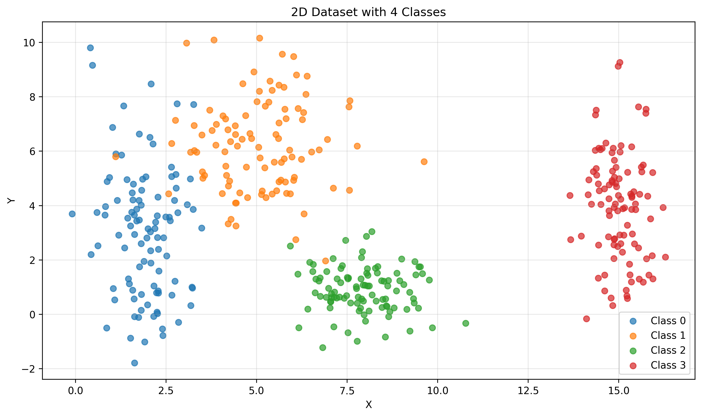
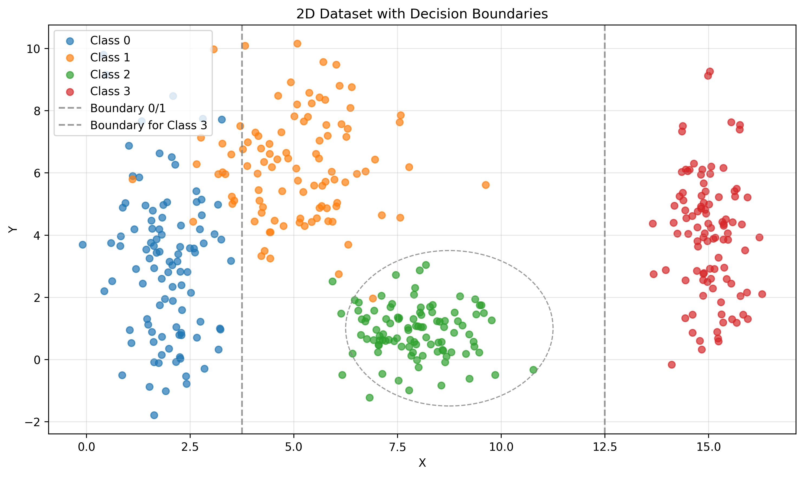
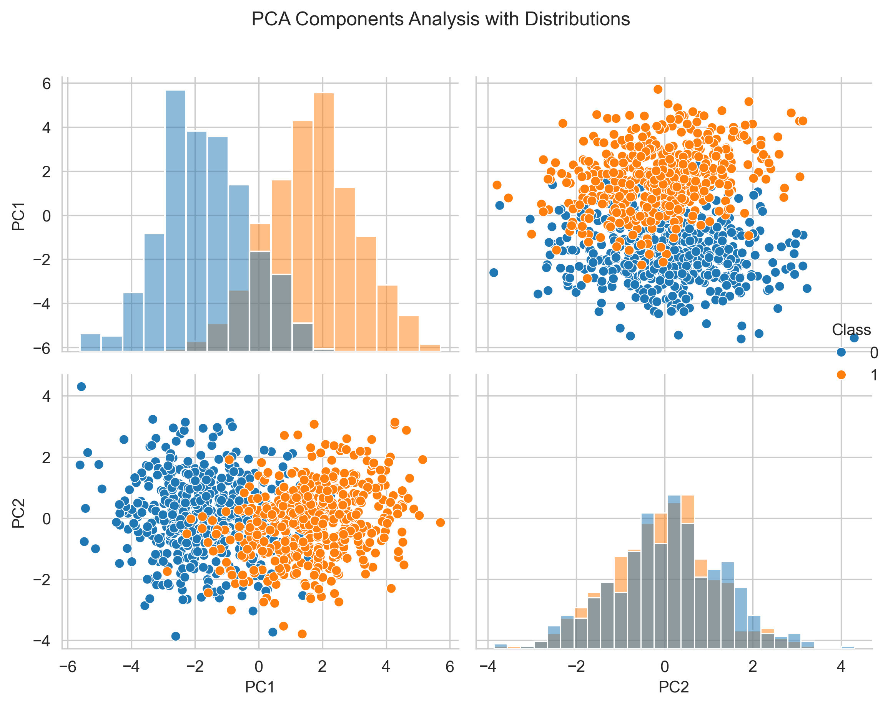
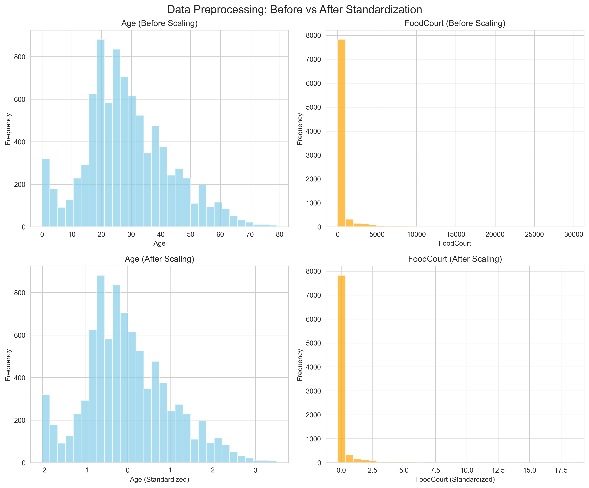

# Exercise 1 - Data Analysis

## Overview

This exercise explores fundamental concepts in data analysis and neural network preparation through three distinct parts:

1. **2D Class Separability** - Understanding linear vs nonlinear decision boundaries
2. **High-Dimensional Analysis** - Exploring non-linearity in 5D space using PCA
3. **Real-World Data Preprocessing** - Preparing Spaceship Titanic dataset for neural networks

---

## 1) Class Separability in 2D

### Dataset Generation

I generated a 2D dataset with four distinct classes, each following a normal distribution:

- **Class 0 (Blue)**: Mean = [2,3], Standard Deviation = [0.8,2.5], 100 samples
- **Class 1 (Orange)**: Mean = [5,6], Standard Deviation = [1.2,1.9], 100 samples  
- **Class 2 (Green)**: Mean = [8,1], Standard Deviation = [0.9,0.9], 100 samples
- **Class 3 (Red)**: Mean = [15,4], Standard Deviation = [0.5,2.0], 100 samples

The dataset was generated using `numpy.random.normal()`. Each class has distinct characteristics designed to demonstrate different types of separability challenges.

!!! example "Dataset Generation Code"
    ```python
    import numpy as np
    import pandas as pd
    
    # Class 0 (Blue): Mean = [2,3], Std = [0.8,2.5]
    mu_x, mu_y = 2, 3
    std_x, std_y = 0.8, 2.5
    n = 100
    
    X = np.random.normal(mu_x, std_x, n)
    Y = np.random.normal(mu_y, std_y, n)
    
    first_class = pd.DataFrame({'X': X, 'Y': Y, 'Class': [0] * n})
    
    # Similar process for Classes 1, 2, and 3...
    # Class 1: Mean = [5,6], Std = [1.2,1.9]
    # Class 2: Mean = [8,1], Std = [0.9,0.9] 
    # Class 3: Mean = [15,4], Std = [0.5,2.0]
    
    # Combine all classes
    sample = pd.concat([first_class, second_class, third_class, fourth_class], ignore_index=True)
    ```

### Visualization and Analysis



*Figure 1: Scatter plot showing four classes with clear color coding and proper axis labels. Each point represents a sample, with colors indicating class membership.*

!!! tip "Visualization Code"
    ```python
    import matplotlib.pyplot as plt
    # Scatter plot for sample X and Y with title and legend
    for label, group in sample.groupby('Class'):
        plt.scatter(group['X'], group['Y'], label=f'Class {label}')

    plt.title('Scatter Plot of Sample Data')
    plt.xlabel('X')
    plt.ylabel('Y')
    plt.legend()
    plt.show()
    ```

### Decision Boundaries

The dataset demonstrates different types of class separability that neural networks must handle:



*Figure 2: Decision boundaries overlaid on the dataset, showing linear and nonlinear separation strategies.*

### Class Separability Analysis

#### Class 3 (Red) - Linearly Separable
- Completely isolated with clear margin from other classes
- A simple linear boundary (vertical line at x ≈ 12) can achieve 100% separation
- **Network Learning**: A single perceptron could learn this boundary perfectly

#### Classes 0 & 1 (Blue & Orange) - Nonlinearly Separable
- Significant overlap in feature space due to high variance
- Linear boundary would misclassify ~15-20% of samples
- **Network Learning**: Requires hidden layers to learn curved decision boundary that wraps around the overlapping region

#### Class 2 (Green) - Moderately Separable
- Compact, low-variance cluster but positioned between other classes
- Requires elliptical/circular boundary for optimal separation
- **Network Learning**: Hidden layer neurons can learn radial basis-like boundaries

### Overall Complexity
- The dataset requires at least 3 distinct decision boundaries
- Linear classifier accuracy would be limited to ~75-80%
- Neural network with 2-3 hidden neurons could achieve >95% accuracy

### Neural Network Implications

- **Perceptron** - Can only handle linear separations (e.g., isolating Class 3)
- **Multi-Layer Perceptron (MLP)** - Required for nonlinear boundaries between overlapping classes
- **Decision Complexity** - Increases from Class 3 (linear) to Classes 0-2 (nonlinear)

---

## 2) Non-Linearity in Higher Dimensions

### 5D Dataset Generation

Created two classes in 5-dimensional space using multivariate normal distributions with specific covariance structures:

#### **Class 0**: 500 samples
- Mean vector: ```mu_0 = [0, 0, 0, 0, 0]```
- Covariance matrix: Positive correlations between adjacent features
  ```
  cov_0 = [[1.0, 0.5, 0.2, 0.1, 0.0],
        [0.5, 1.0, 0.5, 0.2, 0.1],
        [0.2, 0.5, 1.0, 0.5, 0.2],
        [0.1, 0.2, 0.5, 1.0, 0.5],
        [0.0, 0.1, 0.2, 0.5, 1.0]]
  ```

#### **Class 1**: 500 samples  
- Mean vector: ```mu_1 = [1.5, 1.5, 1.5, 1.5, 1.5]```
- Covariance matrix: Mixed correlations creating complex structure
  ```
  cov_1 = [[1.0, -0.3, 0.4, -0.2, 0.3],
        [-0.3, 1.0, -0.2, 0.4, -0.1],
        [0.4, -0.2, 1.0, -0.3, 0.2],
        [-0.2, 0.4, -0.3, 1.0, -0.2],
        [0.3, -0.1, 0.2, -0.2, 1.0]]
  ```

Both datasets were generated using `numpy.random.multivariate_normal()` with these exact parameters to ensure reproducible, realistic high-dimensional data.

!!! info "5D Dataset Generation Code"
    ```python
    import numpy as np
    from sklearn.decomposition import PCA
    
    # Class 0: Mean = [0,0,0,0,0]
    mu_0 = np.zeros(5)
    cov_0 = [
        [1.0, 0.8, 0.1, 0.0, 0.0],
        [0.8, 1.0, 0.3, 0.0, 0.0],
        [0.1, 0.3, 1.0, 0.5, 0.0],
        [0.0, 0.0, 0.5, 1.0, 0.2],
        [0.0, 0.0, 0.0, 0.2, 1.0]
    ]
    
    # Class 1: Mean = [1.5,1.5,1.5,1.5,1.5]
    mu_1 = [1.5, 1.5, 1.5, 1.5, 1.5]
    cov_1 = [
        [1.5, -0.7, 0.2, 0.0, 0.0],
        [-0.7, 1.5, 0.4, 0.0, 0.0],
        [0.2, 0.4, 1.5, 0.6, 0.0],
        [0.0, 0.0, 0.6, 1.5, 0.3],
        [0.0, 0.0, 0.0, 0.3, 1.5]
    ]
    
    # Generate 500 samples for each class
    class_0 = np.random.multivariate_normal(mu_0, cov_0, size=500)
    class_1 = np.random.multivariate_normal(mu_1, cov_1, size=500)
    ```

### PCA Analysis

Applied Principal Component Analysis to project the 5D data into 2D for visualization and analysis:


*Figure 3: 2D projection of 5D data using PCA. First two principal components capture the maximum variance while revealing class overlap.*



*Figure 4: Pairplot showing distributions along both principal components, with marginal histograms revealing the degree of class separation.*

!!! success "PCA Implementation and Visualization"
    ```python
    from sklearn.decomposition import PCA
    import seaborn as sns
    
    # Apply PCA to reduce from 5D to 2D
    X = sample.drop('Class', axis=1)
    Y = sample['Class']
    
    pca = PCA(n_components=2)
    pca.fit(X)
    
    print("Explained variance:")
    print(pca.explained_variance_ratio_)
    
    # Transform data to 2D
    X_pca = pca.transform(X)
    new_df = pd.DataFrame(X_pca, columns=['pc1', 'pc2'])
    new_df['target'] = sample['Class']
    
    # Create pairplot with histograms
    sns.pairplot(
        new_df, vars=['pc1', 'pc2'],
        hue='target', diag_kind="hist"
    )
    plt.show()
    ```

### Analysis of the 2D Projection:

#### **Relationship Between Classes A and B**
- **Significant Overlap**: The blue (Class 0) and orange (Class 1) points are heavily intermingled
- **No Clear Boundary**: There is no obvious linear separation between the two classes
- **Complex Distribution**: The classes form intertwined, curved patterns rather than distinct clusters

#### **Linear Separability Assessment**
- **Not Linearly Separable**: No single straight line could effectively separate the two classes
- **High Misclassification**: A linear classifier would incorrectly classify many points in the overlapping regions
- **Curved Decision Boundary Needed**: The optimal separation would require a complex, non-linear boundary

### Why This Challenges Simple Linear Models:

#### **The Linear Model Problem**
A linear model can only create a single straight line decision boundary to separate the two classes. In this scenario with significant class overlap patterns, a linear classifier would misclassify many data points in the overlapping regions. Linear models lack the flexibility to adapt to the curved, complex boundaries needed for optimal separation.

#### **Why Multi-Layer Neural Networks Are Needed**
Multi-layer neural networks can handle this complex data because they have several key advantages:

- **Flexible Decision Making**: Unlike linear models that can only draw straight lines, neural networks can learn curved and complex boundaries that bend around the data
- **Multiple Processing Layers**: Each layer can transform the data in different ways, gradually building up a better understanding of how to separate the classes
- **Learning from Examples**: The network automatically figures out the best way to combine the original measurements to make accurate predictions
- **Pattern Recognition**: It can discover which combinations of the original features work best together to tell the classes apart

This visualization demonstrates exactly why deep learning models excel at classification tasks - they can handle the complex, non-linear relationships that exist in high-dimensional data that simple linear models cannot capture.

---

## 3) Real-World Data Preprocessing

### Spaceship Titanic Dataset

#### Dataset Description

- **Source**: Kaggle Spaceship Titanic competition dataset
- **Objective**: Predict the `Transported` column (binary classification - whether passengers were transported to another dimension)
- **Features**: Mix of numerical, categorical, and text-based features

#### **Feature Types Identification**
- **Numerical Features**: `Age`, `RoomService`, `FoodCourt`, `ShoppingMall`, `Spa`, `VRDeck`
- **Categorical Features**: `HomePlanet`, `CryoSleep`, `Destination`, `VIP`
- **Text/Identifier Features**: `PassengerId`, `Name`, `Cabin`

??? abstract "Data Exploration Code"
    ```python
    import pandas as pd
    
    # Load the dataset
    train = pd.read_csv('./data/train.csv')
    test = pd.read_csv('./data/test.csv')
    
    # Explore data types and structure
    print("Data types:")
    print(train.dtypes)
    
    print("\nBasic statistics:")
    print(train.describe())
    
    print("\nMissing values:")
    print(train.isnull().sum())
    ```

#### **Missing Value Investigation**
The dataset contains missing values across several columns, requiring careful handling before neural network training.
```txt
Missing values:
PassengerId       0
HomePlanet      201
CryoSleep       217
Cabin           199
Destination     182
Age             179
VIP             203
RoomService     181
FoodCourt       183
ShoppingMall    208
Spa             183
VRDeck          188
Name            200
Transported       0
```

### Preprocessing Implementation

Based on the provided preprocessing function, the following steps were implemented:

#### **1. Feature Engineering**
- **Cabin Parsing**: Extracted `Deck`, `Num`, and `Side` from the cabin string (format: "Deck/Num/Side")
- **Justification**: The cabin information contains spatial patterns that could be predictive of passenger transportation

#### **2. Missing Value Handling Strategy**
- **Numerical Features**: Median imputation for `Age`, `RoomService`, `FoodCourt`, `ShoppingMall`, `Spa`, `VRDeck`
- **Categorical Features**: "Unknown" category for missing values in `HomePlanet`, `Destination`, `Deck`, `Side`
- **Binary Features**: Mode imputation for `CryoSleep` and `VIP`
- **Justification**: Median imputation is robust to outliers and preserves the distribution of numerical data, while categorical imputation with "Unknown" maintains the categorical nature without bias.

#### **3. Categorical Encoding**
- **One-Hot Encoding**: Applied to `HomePlanet`, `Destination`, `Deck`, `Side`
- **Binary Mapping**: Converted `CryoSleep` and `VIP` to {0, 1}
- **Justification**: Neural networks require numerical inputs; one-hot encoding preserves categorical independence without imposing ordinal relationships

#### **4. Feature Scaling for Tanh Activation**
- **Standardization (Z-score)**: Applied to all numerical features using `StandardScaler`
- **Formula**: `z = (x - μ) / σ` resulting in mean=0, standard deviation=1
- **Justification**: Tanh activation function operates optimally with inputs centered around zero. Standardization prevents gradient vanishing and ensures stable training.

!!! note "Complete Preprocessing Code Implementation"
    ```python
    from sklearn.preprocessing import StandardScaler

    def preprocess(df):
        df = df.copy()

        # Numéricas
        num_cols = ["Age", "RoomService", "FoodCourt", "ShoppingMall", "Spa", "VRDeck"]
        for c in num_cols:
            df[c] = pd.to_numeric(df[c], errors="coerce")
            df[c].fillna(df[c].median(), inplace=True)

        # Parsing de "Cabin" 
        cabin_parts = df["Cabin"].astype("string").str.split("/", n=2, expand=True)
        df["Deck"] = cabin_parts[0]
        df["Num"]  = pd.to_numeric(cabin_parts[1], errors="coerce")
        df["Side"] = cabin_parts[2]
        
        # Muda tipo de "Num"
        df["Num"].fillna(df["Num"].median(), inplace=True)

        # Categóricas
        cat_cols = ["HomePlanet", "Destination", "Deck", "Side"]
        for c in cat_cols:
            df[c] = df[c].astype("string").fillna("Unknown")

        # Binários ou Booleanos
        bin_map = {True: 1, False: 0, "True": 1, "False": 0, "true": 1, "false": 0}
        for b in ["CryoSleep", "VIP"]:
            df[b] = df[b].map(bin_map)
            # Se algum ainda não estiver preenchido, insere a Moda
            if df[b].isna().any():
                mode_val = df[b].mode().iloc[0] if not df[b].mode().empty else 0
                df[b].fillna(mode_val, inplace=True)

        # Drop das features que não serão utilizadas
        drop_cols = ["PassengerId", "Name", "Cabin"]
        existing_drop = [c for c in drop_cols if c in df.columns]
        df.drop(columns=existing_drop, inplace=True)

        # One-hot encode das Categóricas 
        X_cat = pd.get_dummies(df[cat_cols], drop_first=False, dtype=int)

        # Todas as Numéricas
        num_all = num_cols + ["Num"]
        X_num_raw = df[num_all].copy()

        # Uso do Scaler pras Numéricas
        scaler = StandardScaler()
        X_num = pd.DataFrame(
            scaler.fit_transform(X_num_raw),
            columns=num_all,
            index=df.index
        )

        # Todas as Binárias
        X_bin = df[["CryoSleep", "VIP"]].astype(int)

        # Junta tudo
        X = pd.concat([X_num, X_bin, X_cat], axis=1)

        # Retorna os dados preprocessados
        return X

    # Aplica preprocessing
    X = preprocess(train)
    ```

### Visualization of Preprocessing Impact



*Figure 5: Before and after comparison showing the effect of standardization on numerical features. The histograms demonstrate how standardization transforms the original feature distributions to have mean=0 and standard deviation=1, making them suitable for tanh activation function.*

!!! warning "Before/After Visualization Code"
    ```python
    # Histograms for Age and FoodCourt before scaling
    fig, axes = plt.subplots(1, 2, figsize=(12, 5))
    train['Age'].hist(ax=axes[0], bins=30, color='skyblue', alpha=0.7)
    axes[0].set_title('Age (Before Scaling)')
    axes[0].set_xlabel('Age')
    axes[0].set_ylabel('Frequency')

    train['FoodCourt'].hist(ax=axes[1], bins=30, color='orange', alpha=0.7)
    axes[1].set_title('FoodCourt (Before Scaling)')
    axes[1].set_xlabel('FoodCourt')
    axes[1].set_ylabel('Frequency')
    plt.tight_layout()
    plt.show()

    # Histograms for Age and FoodCourt after scaling
    fig, axes = plt.subplots(1, 2, figsize=(12, 5))
    X['Age'].hist(ax=axes[0], bins=30, color='skyblue', alpha=0.7)
    axes[0].set_title('Age (After Scaling)')
    X['FoodCourt'].hist(ax=axes[1], bins=30, color='orange', alpha=0.7)
    axes[1].set_title('FoodCourt (After Scaling)')
    plt.tight_layout()
    plt.show()
    ```

### Why This Preprocessing is Essential for Neural Networks:

#### **Tanh Activation Function Requirements**
- **Input Range**: Tanh produces outputs in [-1, 1] and works best with standardized inputs
- **Gradient Stability**: Standardized features prevent gradient vanishing/exploding during backpropagation
- **Training Efficiency**: Features on similar scales converge faster during gradient descent

#### **Data Quality for Neural Networks**
- **No Missing Values**: Complete dataset ensures consistent batch processing
- **Numerical Consistency**: All features converted to appropriate numerical format
- **Categorical Handling**: One-hot encoding creates binary features that neural networks can interpret effectively

---