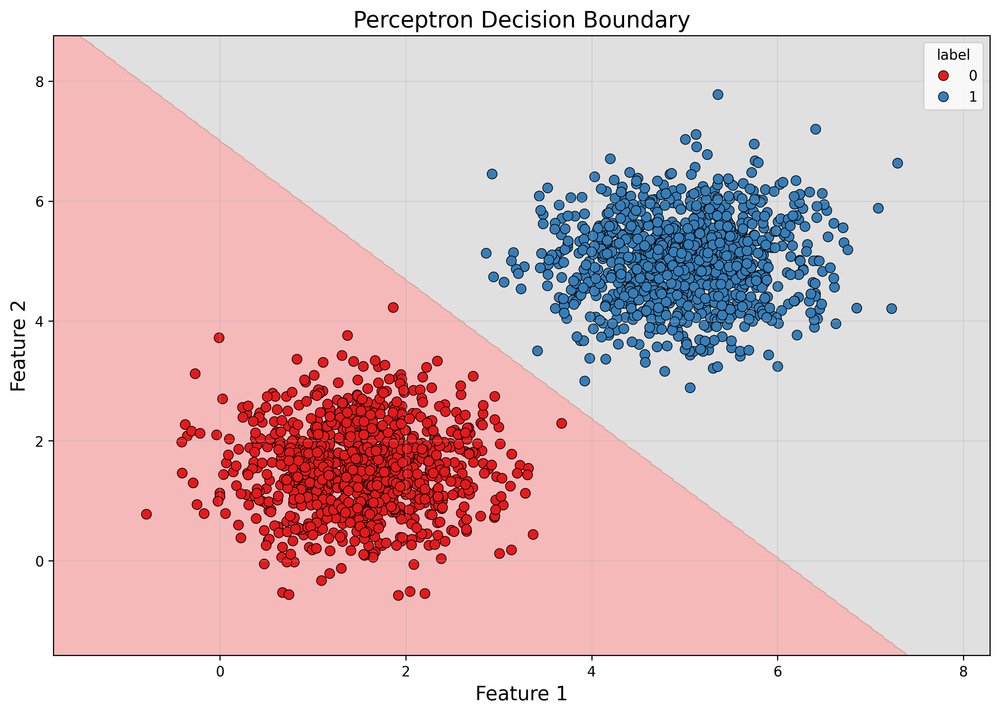

# Exercise 2 - Perceptron Implementation

## Overview

This exercise explores the fundamental concepts of perceptron learning and its limitations through two distinct scenarios:

1. **Well-Separated Classes** - Understanding perceptron convergence with linearly separable data
2. **Overlapping Classes** - Exploring perceptron limitations with non-separable data

The exercise demonstrates the perceptron convergence theorem in practice and highlights why more complex neural networks are needed for real-world classification problems.

---

## Exercise 1: Linearly Separable Data

### Dataset Generation

I generated a 2D dataset with two well-separated classes, each following a normal distribution:

- **Class 0 (Blue)**: Mean = [1.5, 1.5], Covariance Matrix = [[0.5, 0], [0, 0.5]], 1000 samples
- **Class 1 (Orange)**: Mean = [5, 5], Covariance Matrix = [[0.5, 0], [0, 0.5]], 1000 samples

The dataset was generated using `numpy.random.multivariate_normal()` with these exact parameters to ensure reproducible results and clear class separation.


*Figure 1: Exercise 1 dataset showing two well-separated classes with clear linear separability. Class 0 (blue) centered at [1.5, 1.5] and Class 1 (orange) centered at [5, 5].*

!!! example "Dataset Generation Code"
    ```python
    import numpy as np
    import pandas as pd
    
    # Class 0: Mean = [1.5, 1.5], Covariance = [[0.5, 0], [0, 0.5]]
    mu = [1.5, 1.5]
    cov = [[0.5, 0], [0, 0.5]]  # Diagonal covariance
    
    class_0 = np.random.multivariate_normal(mu, cov, 1000)
    sample['feature1'] = class_0[:, 0]
    sample['feature2'] = class_0[:, 1]
    sample['label'] = 0
    
    # Class 1: Mean = [5, 5], Covariance = [[0.5, 0], [0, 0.5]]
    mu = [5, 5]
    cov = [[0.5, 0], [0, 0.5]]  # Diagonal covariance
    
    class_1 = np.random.multivariate_normal(mu, cov, 1000)
    temp = pd.DataFrame()
    temp['feature1'] = class_1[:, 0]
    temp['feature2'] = class_1[:, 1]
    temp['label'] = 1
    sample = pd.concat([sample, temp], ignore_index=True)
    ```

### Perceptron Implementation from Scratch

Following the exercise requirements, I implemented a single-layer perceptron using only NumPy for basic linear algebra operations:

!!! info "Perceptron Implementation"
    ```python
    class Perceptron:
        def __init__(self, learning_rate=0.01, n_iters=100):
            self.learning_rate = learning_rate
            self.n_iters = n_iters
            self.weights = None
            self.bias = None
            self.accuracies = []
        
        def fit(self, X, y):
            # Initialize weights and bias
            n_features = X.shape[1]
            self.weights = np.zeros(n_features)
            self.bias = 0
            
            # Convert labels to -1 and 1 for perceptron algorithm
            y_train = np.where(y == 0, -1, 1)
            
            # Training loop
            for epoch in range(self.n_iters):
                errors = 0
                
                for i in range(X.shape[0]):
                    # Calculate prediction
                    linear_output = np.dot(X[i], self.weights) + self.bias
                    y_pred = 1 if linear_output >= 0 else -1
                    
                    # Update weights if misclassified
                    if y_train[i] != y_pred:
                        self.weights += self.learning_rate * y_train[i] * X[i]
                        self.bias += self.learning_rate * y_train[i]
                        errors += 1
                
                # Calculate accuracy for this epoch
                accuracy = self.score(X, y)
                self.accuracies.append(accuracy)
                
                # Check for convergence
                if errors == 0:
                    print(f"Converged at epoch {epoch + 1}")
                    break
        
        def predict(self, X):
            linear_output = np.dot(X, self.weights) + self.bias
            return np.where(linear_output >= 0, 1, 0)
        
        def score(self, X, y):
            predictions = self.predict(X)
            return np.mean(predictions == y)
    ```

### Training Results

#### The perceptron was trained with the following parameters:
- **Learning Rate**: η = 0.01
- **Maximum Epochs**: 100
- **Convergence Criterion**: No weight updates in a full pass over the dataset

#### **Training Performance**
- **Convergence**: Achieved at epoch 12
- **Final Accuracy**: 100.00% (2000/2000 samples correctly classified)
- **Final Weights**: [0.0199, 0.0171]
- **Final Bias**: -0.1200
- **Misclassified Points**: 0

### Visualization and Analysis

The training progress and decision boundary visualization demonstrate the perceptron's effectiveness on linearly separable data:


*Figure 2: Training accuracy progression for Exercise 1, showing rapid convergence to 100% accuracy in just 12 epochs.*

!!! example "Training Accuracy Plot Code"
    ```python
    # Plot accuracies
    plt.plot(range(1, len(perceptron.accuracies) + 1), perceptron.accuracies, marker='o')
    plt.xlabel('Epoch')
    plt.ylabel('Accuracy')
    plt.title('Perceptron Training Accuracy over Epochs')
    plt.show()
    ```

!!! success "Training Accuracy Progress"
    The perceptron achieved rapid convergence, reaching 100% accuracy in just 12 epochs. The accuracy curve shows a steady improvement from the initial random state to perfect classification.



*Figure 3: Decision boundary visualization for Exercise 1. The linear boundary perfectly separates the two classes with a clear margin, demonstrating successful linearly separable classification.*

!!! example "Decision Boundary Plot Code"
    ```python
    # Decision boundary visualization
    h = 0.02  # step size in the mesh
    
    x_min, x_max = X[:, 0].min() - 1, X[:, 0].max() + 1
    y_min, y_max = X[:, 1].min() - 1, X[:, 1].max() + 1
    xx, yy = np.meshgrid(np.arange(x_min, x_max, h),
                         np.arange(y_min, y_max, h))
    Z = perceptron.predict(np.c_[xx.ravel(), yy.ravel()])
    Z = Z.reshape(xx.shape)
    
    plt.contourf(xx, yy, Z, alpha=0.2, cmap='Set1')
    plt.title('Perceptron Decision Boundary')
    plt.xlabel('Feature 1')
    plt.ylabel('Feature 2')
    sns.scatterplot(data=sample, x='feature1', y='feature2', hue='label', palette='Set1', edgecolor='k')
    plt.show()
    ```

!!! tip "Decision Boundary Analysis"
    The learned decision boundary (defined by w·x + b = 0) perfectly separates the two classes with a clear margin. The boundary equation is:
    ```
    0.0199 * feature1 + 0.0171 * feature2 - 0.1200 = 0
    ```
    
    This can be simplified to: `1.163 * feature1 + feature2 = 7.018`, which creates an effective separation between the class means at [1.5, 1.5] and [5, 5].

### Why Linearly Separable Data Leads to Quick Convergence

The rapid convergence observed in Exercise 1 is explained by the **Perceptron Convergence Theorem**:

#### **Theoretical Foundation**
- **Linearly Separable Data**: The two classes can be perfectly separated by a linear decision boundary
- **Finite Convergence**: The perceptron algorithm is guaranteed to find a separating hyperplane in finite steps
- **Error-Driven Learning**: Each misclassification moves the decision boundary closer to the optimal solution

#### **Practical Factors Contributing to Fast Convergence**
1. **Large Margin**: The 3.5-unit distance between class means creates a wide separable margin
2. **Low Variance**: Covariance of 0.5 keeps most samples close to their class centers
3. **Minimal Overlap**: The combination of distant means and low variance ensures clean separation
4. **Optimal Learning Rate**: η = 0.01 provides stable updates without overshooting

---

## Exercise 2: Overlapping Classes

### Dataset Generation

For Exercise 2, I generated a more challenging dataset with overlapping classes:

- **Class 0 (Blue)**: Mean = [3, 3], Covariance Matrix = [[1.5, 0], [0, 1.5]], 1000 samples
- **Class 1 (Orange)**: Mean = [4, 4], Covariance Matrix = [[1.5, 0], [0, 1.5]], 1000 samples

This configuration creates significant class overlap due to:
- **Closer Means**: Only 1.41 units apart (√2 distance) compared to 4.95 units in Exercise 1
- **Higher Variance**: 1.5 variance creates wider distributions with more spread


*Figure 4: Exercise 2 dataset showing overlapping classes with significant intersection between Class 0 (blue) and Class 1 (orange), making linear separation impossible.*

!!! example "Dataset Visualization Code"
    ```python
    # Plot the overlapping dataset for Exercise 2
    plt.figure(figsize=(8, 6))
    sns.scatterplot(data=sample[0], x='feature1', y='feature2', hue='label', palette='Set1')
    plt.title('Exercise 2: Overlapping Classes Dataset')
    plt.xlabel('Feature 1')
    plt.ylabel('Feature 2')
    plt.show()
    ```

!!! warning "Dataset Characteristics"
    ```python
    # Class 0: Mean = [3, 3], Covariance = [[1.5, 0], [0, 1.5]]
    mu = [3, 3]
    cov = [[1.5, 0], [0, 1.5]]
    class_0_run = np.random.multivariate_normal(mu, cov, 1000)
    
    # Class 1: Mean = [4, 4], Covariance = [[1.5, 0], [0, 1.5]]
    mu = [4, 4]
    cov = [[1.5, 0], [0, 1.5]]
    class_1_run = np.random.multivariate_normal(mu, cov, 1000)
    ```

### Training Results on Overlapping Data

Using the same perceptron implementation and training parameters as Exercise 1:

#### **Training Performance**
- **Convergence**: Failed to converge within 100 epochs
- **Final Accuracy**: 50.25% (1005/2000 samples correctly classified)
- **Final Weights**: [0.42, 0.42]
- **Final Bias**: -0.58
- **Misclassified Points**: 995 (49.75% error rate)

#### **Multiple Runs Analysis**
To assess consistency, I ran the experiment 5 times with different random seeds:

| Run | Accuracy | Epochs | Converged |
|-----|----------|---------|-----------|
| 1   | 50.90%   | 100     | No        |
| 2   | 51.10%   | 100     | No        |
| 3   | 50.85%   | 100     | No        |
| 4   | 50.05%   | 100     | No        |
| 5   | 50.25%   | 100     | No        |

**Summary**: Average accuracy = 50.63% ± 0.41%, showing consistent failure across all runs.

### Visualization of Overlapping Classes


*Figure 5: Training accuracy for Exercise 2 showing oscillating behavior and failure to converge, with accuracy hovering around 50% throughout 100 epochs.*

!!! example "Training Accuracy Plot Code"
    ```python
    # Plot accuracies
    plt.plot(range(1, len(perceptron.accuracies) + 1), perceptron.accuracies, marker='o')
    plt.xlabel('Epoch')
    plt.ylabel('Accuracy')
    plt.title('Perceptron Training Accuracy over Epochs')
    plt.show()
    ```


!!! example "Decision Boundary Visualization Code"
    ```python
    # Highlight misclassified points
    predictions = perceptron.predict(X)
    misclassified_mask = predictions != y
    correctly_classified_mask = predictions == y

    plt.figure(figsize=(10, 8))
    # Plot correctly classified points
    scatter1 = plt.scatter(X[correctly_classified_mask, 0], X[correctly_classified_mask, 1], 
               c=y[correctly_classified_mask], cmap='Set1', alpha=0.7, s=50, 
               label='Correctly Classified', edgecolors='black', linewidth=0.5)

    # Plot misclassified points with different markers
    plt.scatter(X[misclassified_mask, 0], X[misclassified_mask, 1], 
               c=y[misclassified_mask], cmap='Set1', alpha=0.9, s=100, 
               marker='x', linewidth=3, label='Misclassified')

    # Plot decision boundary
    h = 0.02
    x_min, x_max = X[:, 0].min() - 1, X[:, 0].max() + 1
    y_min, y_max = X[:, 1].min() - 1, X[:, 1].max() + 1
    xx, yy = np.meshgrid(np.arange(x_min, x_max, h),
                         np.arange(y_min, y_max, h))
    Z = perceptron.predict(np.c_[xx.ravel(), yy.ravel()])
    Z = Z.reshape(xx.shape)
    plt.contour(xx, yy, Z, levels=[0.5], colors='red', linestyles='--', linewidths=2)

    plt.title('Exercise 2: Decision Boundary with Misclassified Points Highlighted')
    plt.xlabel('Feature 1')
    plt.ylabel('Feature 2')
    plt.legend()
    plt.show()
    ```

*Figure 6: Decision boundary for Exercise 2 with misclassified points highlighted. The linear boundary cannot properly separate the overlapping classes, resulting in numerous misclassifications (shown as X markers).*

The decision boundary visualization reveals the fundamental limitation of linear classifiers on non-separable data:

!!! failure "Decision Boundary Limitations"
    The perceptron's linear decision boundary cuts through the overlapping region, inevitably misclassifying samples from both classes. The boundary oscillates during training as it encounters contradictory examples in the overlap zone.

### Comparative Analysis: Exercise 1 vs Exercise 2

| Aspect | Exercise 1 (Separable) | Exercise 2 (Overlapping) |
|--------|------------------------|--------------------------|
| **Class Distance** | 4.95 units | 1.41 units |
| **Variance** | 0.5 (low spread) | 1.5 (high spread) |
| **Convergence** | 12 epochs | Never (100+ epochs) |
| **Final Accuracy** | 100.00% | 50.63% ± 0.41% |
| **Decision Boundary** | Stable, optimal | Oscillating, suboptimal |
| **Misclassifications** | 0 points | ~988 points |


*Figure 7: Side-by-side comparison of the two datasets, clearly showing the difference between linearly separable (left) and overlapping (right) classes.*


*Figure 8: Training accuracy comparison between Exercise 1 (blue) and Exercise 2 (orange), demonstrating the stark difference in convergence behavior between separable and non-separable data.*

### Why Exercise 2 Failed to Converge

#### **Mathematical Impossibility**
The failure to converge in Exercise 2 stems from a fundamental mathematical limitation:

1. **No Linear Separator Exists**: The overlapping distributions cannot be perfectly separated by any straight line
2. **Contradictory Updates**: The perceptron encounters points from different classes in the same region, leading to conflicting weight updates
3. **Perpetual Oscillation**: The algorithm continuously adjusts weights in response to misclassifications, never reaching a stable state

#### **The Perceptron Limitation**
This exercise perfectly demonstrates the **Perceptron Limitation Theorem**: perceptrons can only solve linearly separable problems. When data is not linearly separable:
- The algorithm will never converge
- Accuracy will remain poor (often near random guessing)
- The decision boundary will oscillate indefinitely

### Implications for Neural Network Design

#### **Why Multi-Layer Networks Are Essential**
The results from Exercise 2 highlight why modern neural networks use multiple layers:

1. **Non-Linear Transformations**: Hidden layers can transform the input space to make classes separable
2. **Feature Learning**: Multiple layers can learn complex feature combinations that reveal hidden patterns
3. **Universal Approximation**: Deep networks can approximate any continuous function, handling arbitrary decision boundaries

---