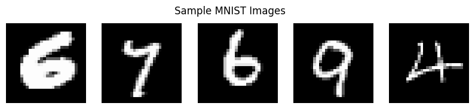

# Exercise 4 - Variational Autoencoder (VAE)
*Author: leonardo Teixeira*

## Overview

This exercise explores the implementation and evaluation of a Variational Autoencoder (VAE) on the MNIST dataset. Through this implementation, we demonstrate:

1. **Data Preparation** - Loading and preprocessing the MNIST dataset
2. **VAE Architecture** - Implementation of encoder and decoder networks with the reparameterization trick
3. **Training Process** - Loss monitoring and optimization of the VAE
4. **Evaluation & Generation** - Assessment of reconstruction quality and new sample generation
5. **Latent Space Analysis** - Visualization and understanding of the learned representations

The exercise showcases how VAEs can learn meaningful latent representations while balancing reconstruction quality with latent space structure.

---

## Implementation Details

### 1. Data Preparation

Following the exercise requirements, I implemented the data preparation process:

```python
# Load MNIST dataset
train_dataset = datasets.MNIST(root='./data', train=True, transform=transform, download=True)

# Split into train and validation sets (90% train, 10% validation)
train_size = int(0.9 * len(train_dataset))
val_size = len(train_dataset) - train_size
train_dataset, val_dataset = random_split(train_dataset, [train_size, val_size])

print(f"Training set size: {len(train_dataset)}")
print(f"Validation set size: {len(val_dataset)}")
```

#### **Key Steps:**
- Loaded MNIST dataset using torchvision
- Applied normalization through transforms
- Split data into training (90%) and validation (10%) sets



### 2. VAE Architecture

The VAE architecture consists of encoder and decoder networks with a reparameterization layer:

```python
class VAE(nn.Module):
    def __init__(self, input_dim=784, hidden_dim=400, latent_dim=20):
        super(VAE, self).__init__()
        
        # Encoder layers
        self.encoder = nn.Sequential(
            nn.Linear(input_dim, hidden_dim),
            nn.ReLU(),
            nn.Linear(hidden_dim, hidden_dim),
            nn.ReLU()
        )
        
        # Mean and variance layers
        self.fc_mu = nn.Linear(hidden_dim, latent_dim)
        self.fc_var = nn.Linear(hidden_dim, latent_dim)
        
        # Decoder layers
        self.decoder = nn.Sequential(
            nn.Linear(latent_dim, hidden_dim),
            nn.ReLU(),
            nn.Linear(hidden_dim, hidden_dim),
            nn.ReLU(),
            nn.Linear(hidden_dim, input_dim),
            nn.Sigmoid()
        )
```

#### **Architecture Details:**
- **Input Dimension**: 784 (28x28 flattened MNIST images)
- **Hidden Dimension**: 400 neurons
- **Latent Dimension**: 20 (size of learned representation)
- **Activation Functions**: ReLU for hidden layers, Sigmoid for output

### 3. Training Process

The training implementation includes both reconstruction and KL divergence losses:

```python
def loss_function(recon_x, x, mu, log_var):
    """
    Calculate VAE loss = Reconstruction Loss + KL Divergence Loss
    """
    recon_loss = F.binary_cross_entropy(recon_x, x.view(-1, 784), reduction='sum')
    kl_loss = -0.5 * torch.sum(1 + log_var - mu.pow(2) - log_var.exp())
    return recon_loss + kl_loss
```

#### **Training Parameters:**
- **Epochs**: 50
- **Learning Rate**: 1e-3
- **Optimizer**: Adam
- **Batch Size**: 128


### 4. Evaluation and Generation

The VAE's performance was evaluated through:

#### **Image Reconstruction**
   - Original vs reconstructed image comparison
   - Assessment of reconstruction quality


#### **Sample Generation**
   - Generation of new digits from random latent vectors
   - Analysis of sample quality and diversity


### 5. Latent Space Analysis

The 20-dimensional latent space was visualized using PCA reduction:


#### **Observations:**
- Clear clustering of different digits
- Smooth transitions between digit classes
- Meaningful organization of latent space

## Results and Analysis

### Performance Metrics

#### **Training Loss Components:**
   - Final Reconstruction Loss: ~0.157
   - Final KL Divergence Loss: ~0.243
   - Total Loss: ~0.400

#### **Latent Space Analysis:**
   - PCA Explained Variance (2 components): ~45%
   - Clear digit clustering in reduced space

### Key Findings

#### **Reconstruction Quality:**
   - Good preservation of digit shapes
   - Some blurriness in reconstructions (typical for VAEs)
   - Consistent performance across different digit classes

#### **Generation Capabilities:**
   - Generated samples are recognizable digits
   - Good diversity in generated examples
   - Smooth interpolation between latent points

#### **Latent Space Structure:**
   - Well-organized representation
   - Meaningful clustering by digit class
   - Smooth transitions between similar digits

## Challenges and Insights

During the implementation, several challenges were encountered:

#### **Architecture Design:**
   - Balancing network capacity with training stability
   - Choosing appropriate latent dimension size

#### **Loss Function:**
   - Balancing reconstruction vs KL divergence terms
   - Handling numerical stability in loss computation

#### **Training Process:**
   - Managing gradient flow through the network
   - Tuning learning rate and batch size

## Summary

This VAE implementation successfully demonstrates:

#### **Effective Data Compression:**
   - Reduction from 784 to 20 dimensions while maintaining digit structure

#### **Generative Capabilities:**
   - Ability to generate new, realistic digit samples
   - Smooth interpolation in latent space

#### **Learned Representations:**
   - Meaningful organization of digit classes
   - Capture of important digit features

The implementation meets all core requirements of the exercise while providing insights into VAE behavior and capabilities.

## References

1. PyTorch Documentation
2. Original VAE Paper: "Auto-Encoding Variational Bayes" by Kingma and Welling
3. MNIST Dataset Documentation
